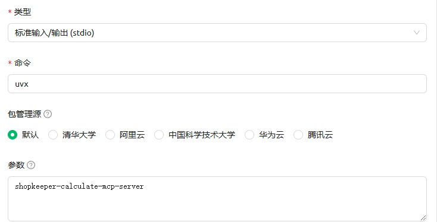

# Shopkeeper Calculate MCP Server
[中文](README.md) | [English](README_en.md)
## 概述

Shopkeeper Calculate MCP Server 是一个用于数学计算的MCP工具，帮助LLM完成复杂数学公式的计算。仅提供数学表达式的解析工具，而非单独的拆分为+-*/等简单运算。

## 安装
### 在Cherry Studio中安装：

#### 方式1、快速创建：


#### 方式2、从json导入：(可以用于其他MCP Client，如Cursor、Cline)

```bash
{
  "mcpServers": {
    "数学计算器": {
      "args": [
        "shopkeeper-calculate-mcp-server"
      ],
      "command": "uvx"
    }
  }
}
```

#### 方式3、使用魔搭托管的MCP服务：
[魔搭跳转链接](https://www.modelscope.cn/mcp/servers/shopkeeper/Math_calculator)

1、使用魔搭免费云端资源部署

2、在Cherry Studio上同步MCP服务器


#### 方式4、本地搭建MCP服务：

1、克隆项目到本地：
```bash
git clone https://github.com/shopkeeper2020/shopkeeper-calculate-mcp-server.git
cd shopkeeper-calculate-mcp-server
```

2、配置环境：
```bash
uv add "mcp[cli]"
uv add numexpr
```

3、启动MCP服务器：
```bash
uv run main-streamable-http.py
```

4、快速创建，选择streamableHttp，URL填入[http:/0.0.0.0:29934/mcp](http:/0.0.0.0:29934/mcp)


## 可用工具
- calculate：计算数学表达式。
    - expression（字符串，必填）：要被计算的数学表达式
