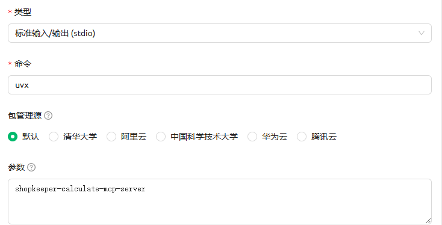

# Shopkeeper Calculate MCP Server
[中文](README.md) | [English](README_en.md)
## Overview

Shopkeeper Calculate MCP Server is an MCP tool designed for mathematical calculations, assisting LLMs in solving complex mathematical formulas. It provides a parser for mathematical expressions, rather than breaking them down into individual simple operations like addition, subtraction, multiplication, and division.

## Installation
### Cherry Studio Installation:
#### Method 1: Quick Creation:

## Available Tools
- calculate: Calculates a mathematical expression.
    - expression (string, required): The mathematical expression to be calculated.