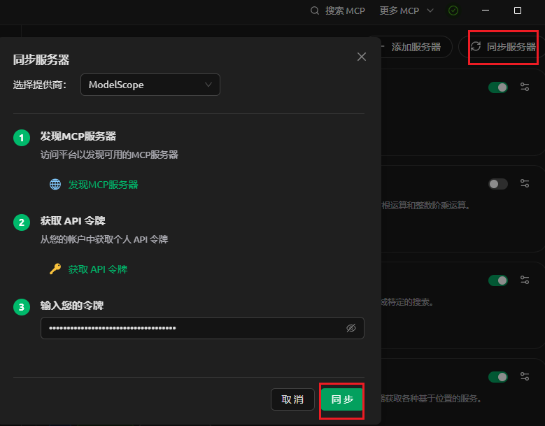
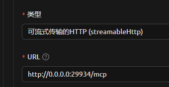

# Shopkeeper Calculate MCP Server
[中文](README.md) | [English](README_en.md)
## Overview

Shopkeeper Calculate MCP Server is an MCP tool designed for mathematical calculations, assisting LLMs in solving complex mathematical formulas. It provides a parser for mathematical expressions, rather than breaking them down into individual simple operations like addition, subtraction, multiplication, and division.

## Installation
### Install in Cherry Studio:

#### Method 1: Quick Creation:


#### Method 2: Import from JSON: (Can be used for other MCP Clients, such as Cursor, Cline)

```bash
{
  "mcpServers": {
    "Mathematical Calculator": {
      "args": [
        "shopkeeper-calculate-mcp-server"
      ],
      "command": "uvx"
    }
  }
}
```

#### Method 3: Use ModelScope Hosted MCP Service:
[ModelScope Jump Link](https://www.modelscope.cn/mcp/servers/shopkeeper/Math_calculator)

1、Deploy using ModelScope's free cloud resources

2、Synchronize MCP Server on Cherry Studio


#### Method 4: Locally Deploy MCP Service:

1、Clone the project locally:
```bash
git clone https://github.com/shopkeeper2020/shopkeeper-calculate-mcp-server.git
cd shopkeeper-calculate-mcp-server
```

2、Configure environment:
```bash
uv add "mcp[cli]"
uv add numexpr
```

3、Start MCP Server:
```bash
uv run main-streamable-http.py
```

4、Quick creation, select streamableHttp, fill in the URL as [http:/0.0.0.0:29934/mcp](http:/0.0.0.0:29934/mcp)


## Available Tools
- calculate: Calculates a mathematical expression.
    - expression (string, required): The mathematical expression to be calculated.